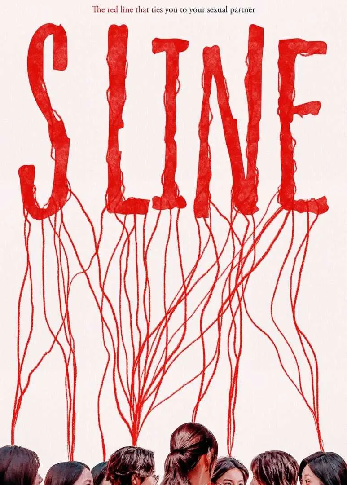

# 🔴 S-Line Visualizer (Concept Project)

## Overview
**S-Line Visualizer** is an experimental web project inspired by the *S-Line* concept from Korean pop culture and dramas, where red lines symbolize hidden connections and abstract relationships.

This project explores how **visual symbolism** can be combined with **camera-based interaction** to create a playful and slightly unsettling experience. The website accesses the user’s camera, captures an image, and overlays **randomized red lines** on the face to mimic the idea of invisible “connections” becoming visible.

This is **not a beauty filter** or a facial rating tool. It is a **conceptual visualization project**.

---

## Core Idea
The original *S-Line* idea represents information that normally remains private suddenly becoming visible.

This project translates that idea into a **visual metaphor**:

- The **face** represents identity  
- The **red lines** represent abstract, hidden data  
- Randomization emphasizes uncertainty, interpretation, and illusion  

The output is intentionally symbolic rather than accurate.

---

## How It Works
1. User clicks on the camera interaction area  
2. Browser requests camera permission  
3. User’s photo is captured  
4. The captured image is displayed  
5. Red lines are programmatically drawn as a visual overlay  

No images are stored or uploaded to any server.

---

## Tech Stack
- HTML  
- CSS  
- JavaScript  
- Browser Camera API (`getUserMedia`)  

---

## Privacy Note
- Camera access is used **only in-browser**
- No photos are saved, uploaded, or shared
- All processing happens locally on the user’s device

---

## Future Improvements
- Face detection to identify facial structure  
- Mathematical scoring based on detected facial landmarks  
- Dynamic logic to generate the **number and placement** of red lines  
- Improved visual realism and animation of line rendering  
- Mobile responsiveness and performance optimizations  

---

## Disclaimer
This project is **experimental and conceptual**.

All visual output is symbolic and randomized, and **does not represent real data, relationships, or personal attributes**.

---

## Motivation
This project was built to:

- Experiment with browser-based camera interaction  
- Explore visual storytelling through code  
- Prototype computer-vision–adjacent ideas before integrating real models  

---
